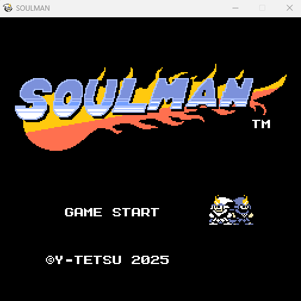
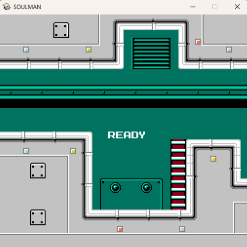

# 🎮 Soulman - Demo Version  
*(Retro-style 2D Action Game / レトロ風2Dアクションゲーム・デモ版)*

---

## 📝 Overview / 概要

**Soulman** is a retro-style 2D action game created with Python and Pygame.  
This demo version includes the first playable stage to showcase the gameplay and design.  

**Soulman** は Python と Pygame で制作されたレトロ風2Dアクションゲームです。  
このデモ版では、プレイ可能な最初のステージを通してゲームの雰囲気を体験できます。

---

## ⚙️ How to Play / 操作方法

### 🎹 Keyboard / キーボード操作
| Action | Key |
|--------|-----|
| Select | Enter |
| Quit | Backspace |
| Move left/right/up/down | A / D / W / S |
| Jump | L |
| Attack | K |
| Mode Change | 8 or 9 |

### 🎮 Controller / コントローラー操作（対応）
| Action | Button |
|--------|---------|
| Select | START |
| Quit | BACK |
| Move | D-Pad / Stick |
| Jump | A |
| Attack | X |
| Mode Change | L2 or R2 |

---

## 🖼️ Screenshots / スクリーンショット

### Title Screen

### In-Game Scene

---

## 📦 Contents / 内容物

- `soulman_v0.1.0_demo.exe` — Windows executable  
  Windows用実行ファイル  
- `LICENSE_SHORT.txt` — License (short version) / 短縮版ライセンス  
- `LICENSE_CODE.txt` — License for the executable / 実行ファイル用ライセンス  
- `LICENSE_ASSETS.txt` — License for images and sounds / 画像・音声用ライセンス  

---

## 🧭 Installation / 実行方法

1. Download the latest `.zip` file from the [Releases](../../releases) page.  
2. Extract it to any folder.  
3. Run `soulman_v0.1.0_demo.exe`.

1. [Releases](../../releases) ページから最新の `.zip` をダウンロード  
2. 任意のフォルダに展開  
3. `soulman_v0.1.0_demo.exe` を実行して開始！

---

## 🏷️ Version & Changelog / バージョンと更新履歴

**v0.1.0-demo (2025-11-09)**  
- First public demo release  
- Includes 1 playable stage and background music  
- 最初のデモ公開版
- 1ステージ・BGM入り

---

## ⚖️ License / ライセンス

- Game executable and code: see [`LICENSE_CODE.txt`](./LICENSE_CODE.txt)  
- Assets (images, sounds): see [`LICENSE_ASSETS.txt`](./LICENSE_ASSETS.txt)  
- Summary: see [`LICENSE_SHORT.txt`](./LICENSE_SHORT.txt)

ゲーム実行ファイルおよびコード、アセット、短縮版ライセンスについては  
上記の各ライセンスファイルをご確認ください。

© 2025 y-tetsu. All rights reserved.  
Unauthorized redistribution or modification is prohibited.  
無断転載・改変を禁じます。

---

## 💬 Feedback / フィードバック

If you encounter bugs or have suggestions, please open an Issue on GitHub.  
不具合報告やご意見がある場合は、GitHub の Issue よりお知らせください。

---

## 🔖 Future Plans / 今後の予定

- Add New Stage and new enemy types  
- Implement new boss battles  
- 新ステージ・新敵キャラの追加  
- 新ボス戦の実装  

---

